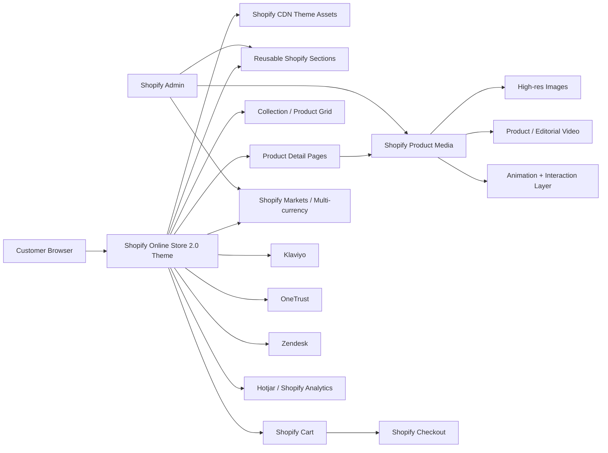
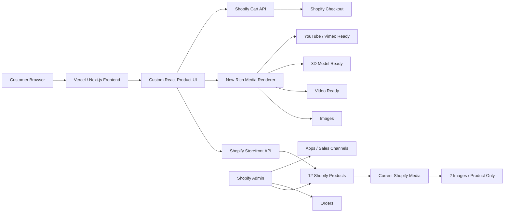
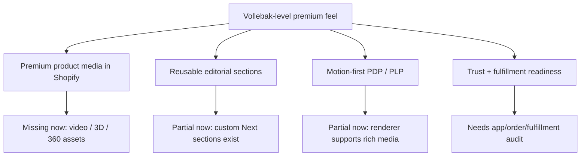

# CARLOPHILLIPS vs Vollebak Architecture

## What Vollebak Appears To Have



### Read

Vollebak is not winning because Shopify alone makes things premium. They have a Shopify Plus / Online Store 2.0 theme architecture, reusable page sections, strong product media, animation, interaction, and content-heavy storytelling built into their storefront.

## What CARLOPHILLIPS Has Now



### Read

CARLOPHILLIPS is structurally capable now, but media-poor. The frontend can render Shopify video and 3D media, but Shopify currently returns only IMAGE media for all 12 products.

## Gap



## Recommended Path

1. Keep Shopify as product, order, app, checkout, payment, and fulfillment backend.
2. Keep Next.js for SEO/frontend, but only if it renders Shopify-native product media and content.
3. Add rich media into Shopify product records:
   - product video
   - 360 spin
   - GLB/USDZ 3D models where practical
   - high-resolution editorial/lifestyle media
4. Use Shopify apps only where they write back to Shopify media, metafields, product pages, or app blocks.
5. Avoid custom one-off visual hacks that live outside the product record.

## Immediate App Candidates

- Cappasity: 3D/360 product viewer and AR-style product experience.
- Zakeke / Angle 3D: 3D product configurator and product model workflows.
- Spin Studio: 360 spin style product viewing.
- Shopify Search & Discovery: native merchandising and filtering.
- Shopify Bundles: native bundles.
- Klaviyo: lifecycle and abandoned checkout email.
- Loox or Judge.me: reviews with photo/social proof.

## Current Production Evidence

Production Shopify media audit:

```json
{
  "shopify": "Connected",
  "productCount": 12,
  "mediaTypeCounts": { "IMAGE": 12 },
  "productsWithoutMotionOr3d": 12
}
```

Order visible in Shopify Admin:

```text
Order: #1001
Customer: james anderson
Channel: Online Store
Total: $47.07
Payment: Paid / Complete
Fulfillment: Unfulfilled
Items: 1
Delivery method: International
```

