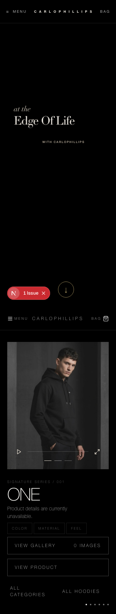
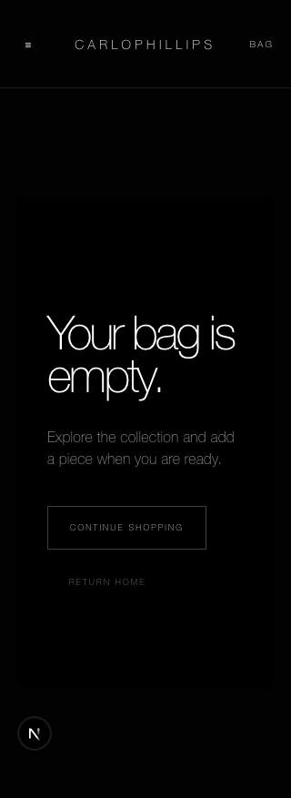
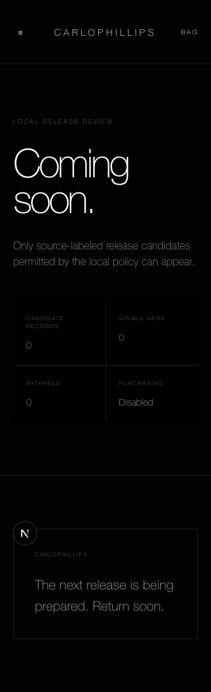
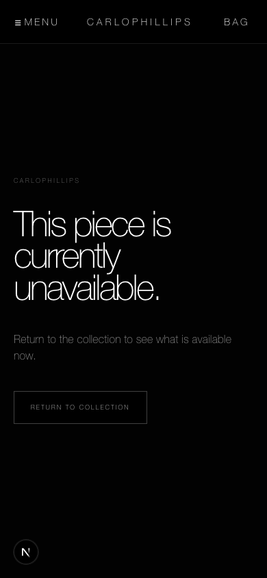
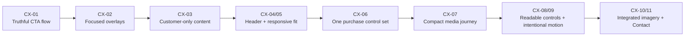
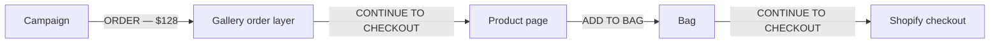
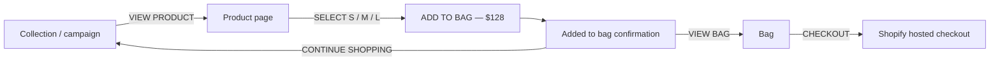
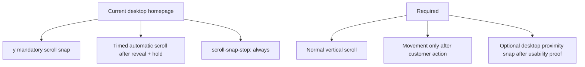

# Customer Experience Corrections

Status: Product Owner-confirmed correction scope  
Confirmed: 2026-09-03  
Applies to: public storefront, canonical Vercel Preview staging, and Production
after staging approval

## Decision

Every item below is a required correction. Priority defines delivery order, not
optionality. Shopify remains authoritative for product, variant, price,
availability, bag/cart, and checkout truth. All visual values must remain
design-system and token controlled.

## Visual executive summary

### Implemented correction preview

| Mobile home                                                                                  | Mobile bag                                                                                | Mobile shop                                                                           | Mobile product fallback                                                                                                             |
| -------------------------------------------------------------------------------------------- | ----------------------------------------------------------------------------------------- | ------------------------------------------------------------------------------------- | ----------------------------------------------------------------------------------------------------------------------------------- |
|  |  |  |  |

The branch preview uses the local fail-closed commerce configuration. Canonical
Staging visual approval must use the Shopify-backed product and bag states after
the branch is merged and the protected Preview deployment succeeds.

### Mobile interaction and layout corrections


### Customer-trust corrections


### Correction map



## Required purchase journey and language

### CX-01 — Correct CTA names and destinations

#### Current journey — incorrect



The first two labels promise an order or checkout but only reveal another layer
or navigate to the PDP.

#### Required journey



```text
Collection or campaign
  -> View product / Shop the hoodie
Product page
  -> Select one available size
  -> Add to bag — $128
Added-to-bag confirmation
  -> Continue shopping OR View bag / Checkout
Bag
  -> Checkout
Shopify hosted checkout
```

- `Bag` is the canonical storefront noun. Do not mix `cart` and `bag` in
  customer copy.
- `Order` is reserved for submitted orders and order history.
- No action may say `Continue to checkout` when it only opens or navigates to a
  product page.
- Campaign and gallery product links use `View product` or `Shop the hoodie`.
- The PDP has one primary `Add to bag — $128` action.
- Successful addition shows product, selected size, quantity, subtotal, updated
  bag count, `Continue shopping`, and `View bag` or `Checkout`.
- A populated bag uses `Checkout` as primary and `Continue shopping` as
  secondary. Unavailable variants show an availability-specific action.

Acceptance: every CTA truthfully describes its immediate result, uses one
terminology system, and the no-order journey reaches trusted Shopify checkout at
desktop, tablet, and mobile widths without entering customer data or submitting
payment/order.

## P0 corrections

### CX-02 — Isolate overlays and sheets


- Show one focused gallery, order, size-guide, added-to-bag, or navigation state
  at a time on an opaque surface with internal scrolling.
- Prevent overlap with underlying media/copy and lock background scrolling.
- Move focus into the surface, trap Tab, close with Escape and outside click,
  and restore focus to the opener.
- Keep content and the primary action reachable at 320×700 and 390×844.

### CX-03 — Remove internal and simulated customer content


- Remove `Commerce truth`, environment, source, eligibility, approval,
  observed, and similar operations language from public bag/cart/product UI.
- Empty bag copy is customer-facing only: `Your bag is empty` and
  `Continue shopping`.
- Remove the Production member review fixture, simulated member number/profile,
  fake saved pieces, and simulated EUR credit.
- `/member` renders exactly one truthful state: signed-out invitation or real
  authenticated Shopify customer account—never signup plus simulated dashboard.

Acceptance: a Production text sweep finds no internal/review/fixture language or
invented customer identity, account, balance, or status.

## P1 corrections

### CX-04 — One responsive header and navigation model


Required narrow-width header:

```text
┌──────────────────────────────────────────┐
│ ☰ MENU        CARLOPHILLIPS       BAG 0 │
└──────────────────────────────────────────┘
```

- Use `Menu / CARLOPHILLIPS / Bag count` across every narrow-width route.
- Do not squeeze desktop `Collection / Member / Bag` links into mobile headers.
- Use `Shop` as the canonical catalog route and redirect `/collections` rather
  than maintaining duplicate public catalog destinations.
- Replace unclear/needless single-product hierarchy such as `Discovery` and
  `All Categories -> Hoodies` with direct customer-readable destinations.
- Show `Member` only when truthful and production-ready.
- Every interactive target is at least 44×44 CSS pixels.

Acceptance: no collision, clipping, missing destination, or inconsistent name
at 320–430 px; the same navigation grammar appears on every public route.

### CX-05 — Remove responsive overflow


| Route          | Viewport | Current document width | Result         |
| -------------- | -------: | ---------------------: | -------------- |
| `/shop`        |   320 px |                 340 px | 20 px overflow |
| `/collections` |   320 px |                 383 px | 63 px overflow |
| `/bag`         |   320 px |                 375 px | 55 px overflow |

- Correct shared header, catalog-card, and bag-layout sizing that currently
  produces documents of 340, 383, and 375 px inside a 320 px viewport.
- Allow grid/flex children to shrink and wrap through design-system rules.

Acceptance: every public route has `scrollWidth <= clientWidth` at 320, 360,
390, 430, 768, 1024, and 1440 px.

### CX-06 — Simplify product purchase controls


```text
CURRENT                         REQUIRED
S   M   L                       S   M   L
[ S — $128          ▼ ]         [ ADD TO BAG — $128 ]
[ ADD TO BAG — $128 ]
Quantity [unstyled input]        Quantity  [−] 1 [+]
```

- Keep one S/M/L button selector; remove the duplicate native size select.
- Normalize visible sizes to uppercase S/M/L.
- Remove review-era `Product attributes` and `Sizes observed` controls/content.
- Use one themed, accessible, bounded quantity control defaulting to one.
- Keep one size guide and one dominant Add-to-Bag action.

Acceptance: one selection controls one authoritative Shopify variant, price,
and availability value sent to the cart boundary.

### CX-07 — Replace the mobile/tablet media wall


|    Width | Current product-page height | Comparison        |
| -------: | --------------------------: | ----------------- |
|   320 px |                    7,821 px | Long              |
|   768 px |                   13,720 px | Worst breakpoint  |
| 1,440 px |                    4,591 px | Desktop reference |

- Do not stack all twelve full-width images before product information.
- Use one hero plus a compact curated set or swipeable carousel from 320–1023
  px, with `View all 12` beside the first media; retain the full approved set in
  the gallery.
- Correct the 768 px breakpoint that creates a 13,720 px product document.

Acceptance: title, price, size, and Add-to-Bag are reachable without traversing
twelve tiles, and tablet does not become materially longer merely because media
grows with viewport width.

### CX-08 — Correct functional type, contrast, and controls

- Increase 9–10 px functional text to a legible tokenized size and do not use
  low opacity for primary navigation or actions.
- Preserve small control artwork but provide at least 44×44 px hit areas for the
  current 24×24 play/expand controls and approximately 20×1 video selectors.
- Provide visible hover, focus, selected, disabled, loading, success, and error
  states.

Acceptance: manual contrast passes on actual backgrounds; keyboard focus is
visible; automated accessibility has no relevant violations; primary touch
targets meet the minimum.

### CX-09 — Correct homepage scrolling, motion, and campaign crop



- Remove the timed automatic scroll to the product section.
- Remove mandatory vertical page snapping. Desktop may use `proximity` only if
  wheel, trackpad, keyboard, and reduced-motion tests remain comfortable;
  mobile vertical scrolling remains normal.
- Smooth movement occurs only after explicit customer action. Horizontal snap
  may remain for a one-image-per-swipe carousel.
- Create a mobile campaign composition without the 25% empty rail, clipped
  embedded artwork text, or unstable header contrast.
- Respect `prefers-reduced-motion` for reveal, autoplay, and scripted motion.

Acceptance: no page movement without customer intent, no mandatory-snap trap,
and campaign subject, lockup, and controls remain composed and readable.

### CX-10 — Integrate truthful product imagery


- Replace the harsh supplier-white collection/PDP canvas with an approved
  transparent or neutral treatment belonging to the visual system.
- Preserve accurate garment shape, color, logo, and construction.

Acceptance: imagery integrates with the dark interface without compromising
product truth or accessible contrast.

## P2 correction

### CX-11 — Rebalance Contact


- Reduce the excessive unused desktop lower-left field and clarify the
  relationship between support information and the form.
- Keep persistent labels, legible controls, keyboard access, and truthful
  success/error states.

## Definition of done

- Implement via components and tokens; no hardcoded staging/Production visual
  values.
- Run Yarn Classic 1.22.22 `yarn lint`, `yarn test`, and `yarn build`.
- Run Playwright interaction, keyboard, reduced-motion, accessibility, route,
  overflow, and CTA-destination checks.
- Verify 320, 360, 390, 430, 768, 1024, and 1440 px.
- Capture before/after screenshots for homepage initial/revealed/discovery,
  menu, gallery/order handoff, PDP top/full, added-to-bag, empty/populated bag,
  member, and contact.
- Verify no internal fixture copy, route-name inconsistency, relevant
  console/page errors, or horizontal overflow.
- Deploy to the single canonical Vercel Preview staging environment for Product
  Owner review. Production requires explicit staging approval.

## Current-state evidence baseline

- `test_reports/pushpa-ui-audit-2026-09-03/`
- `test_reports/pushpa-ui-second-pass-2026-09-03/`
- `test_reports/pushpa-ui-audit-2026-09-03/annotated-mobile-ui.png`
- `test_reports/pushpa-ui-audit-2026-09-03/annotated-trust-cleanup.png`

Passing existing automated tests alone does not close a correction; the related
interaction and screenshot acceptance criteria must also pass.
